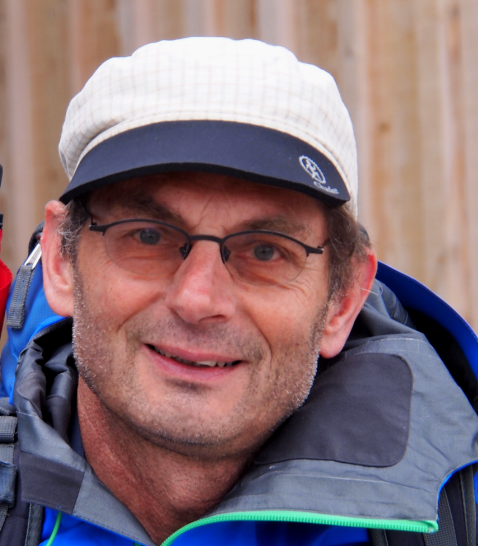
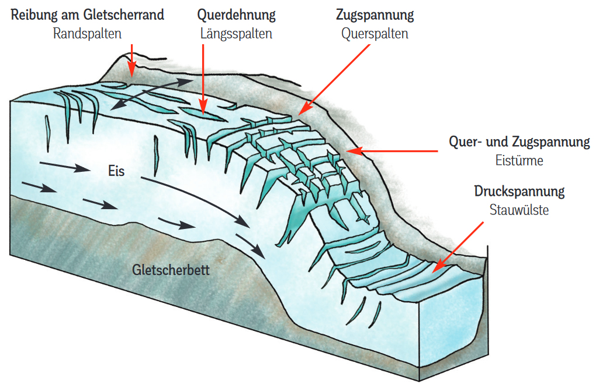
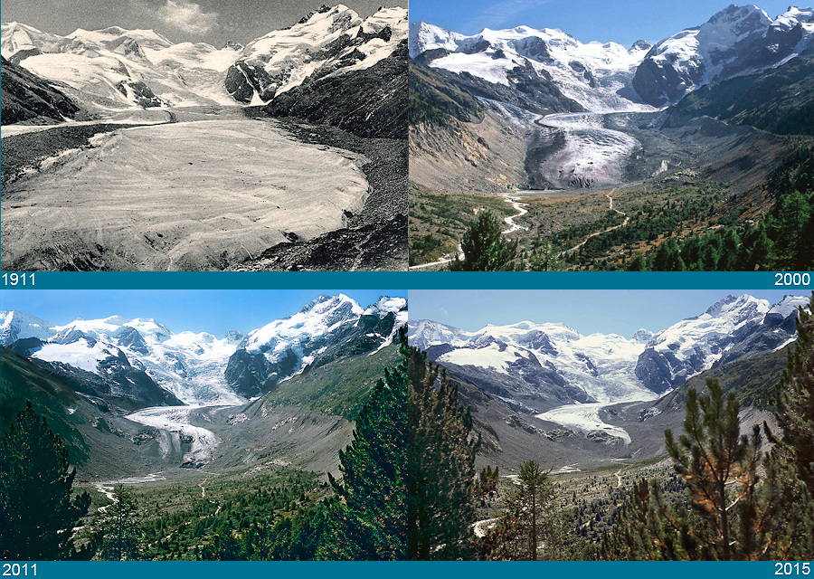
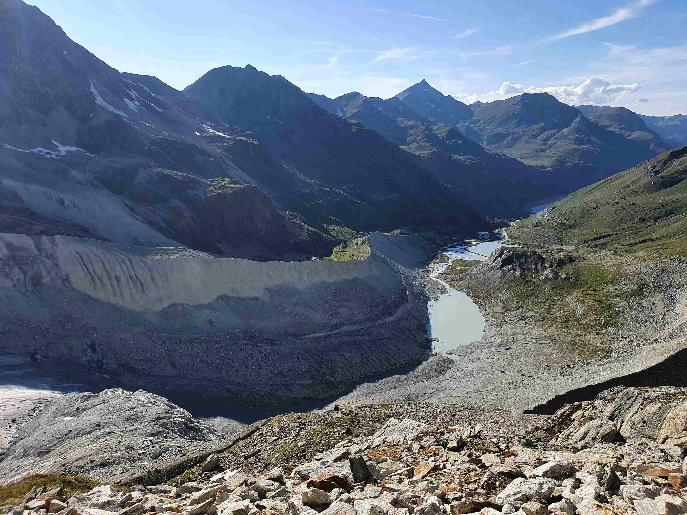
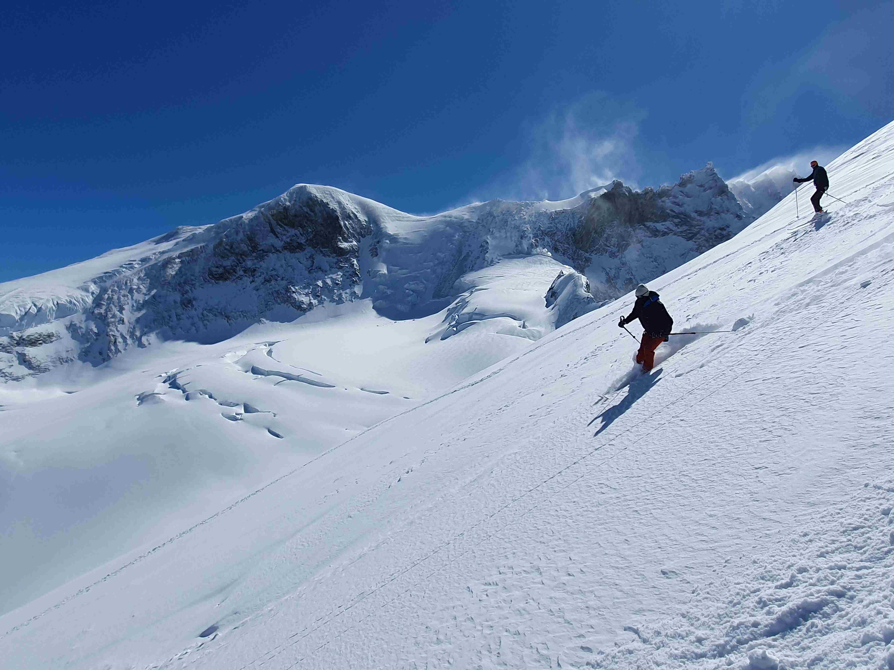

+++
title = "Das stille Leiden der weissen Riesen"
date = "2023-06-15"
draft = false
pinned = false
+++
*Unsere Gletscher ziehen sich immer mehr zurück. Ein erfahrener Bergführer, der seit vielen Jahrzehnten Zeuge des fortschreitenden Abschmelzens geworden ist, teilt seine beeindruckenden Erlebnisse.*

Die Gletscherwelt ist faszinierend, schön und gefährlich zugleich. Viel unberührter Schnee, der sich wie eine Decke über ein Meer aus Eis legt. Das lockt jedes Jahr viele Touristen, Bergsteiger, Bergführer und Skisportler zu uns in die Berge. Mächtige Eisströme mit tiefen Spalten fliessen von den hohen Gipfeln talwärts. Immer öfter stört das Plätschern von Schmelzwasser auch in höheren Lagen die Stille.

Gletscher entstehen an Orten, an denen Niederschlag als Schnee fällt. Bleibt dieser nun längere Zeit liegen und wird von immer mehr Neuschnee überdeckt, wird er zusammengepresst zu Altschnee. Wenn der Schnee länger als ein Jahr liegen bleibt, wird er als Firn oder Firnschnee bezeichnet. Er kristallisiert nach einiger Zeit und wird durch den immer höher werdenden Druck schliesslich zu Gletschereis. Beim Zusammenpressen entweicht die eingeschlossene Luft. Von anfangs 90 % im Neuschnee sind am Ende im Gletschereis nur noch 2 % vorhanden. Weil der Druck nicht beliebig gross werden kann, ist das Eis der tiefsten Schicht nicht vom Eis nahe der Gletscheroberfläche zu unterscheiden.              \
Dieser Prozess wird vom Klimawandel in den meisten Fällen negativ beeinflusst. In seltenen Fällen können höhere Temperaturen das Gletschereiswachstum positiv beeinflussen: wenn Schnee schmilzt und die Temperatur schnell genug herunterkühlt, sodass das Wasser direkt zu Eis gefriert, ohne die verschiedenen Stufen der Umwandlung (Altschnee, Firnschnee) zu durchlaufen. Bedauerlicherweise ist dies zu selten der Fall. Denn wie ein Blick in die Statistik zeigt, verloren die Schweizer Gletscher in den letzten 166 Jahren die Hälfte ihrer Fläche und gar geschätzte 60% ihres Volumens. *(Quelle: https://interaktiv.tagesanzeiger.ch/2017/gletscherschwund/?openincontroller)*

Den fatalen Rückgang der Gletscher musste Jürg Meyer ein leidenschaftlicher Alpinist und Erzähler mit vielen Jahren Berufserfahrung selbst miterleben. Er verbindet spannende Geschichten mit Hintergrundwissen und Fakten. Jürg Meyer kam über den Klettersport zur Jugendorganisation (JO) des SAC (Schweizer Alpen-Club). Dort traf er auf Jugendliche mit der gleichen Begeisterung für den Alpinsport. Auf gemeinsamen Touren merkte er schnell, dass er auch gerne Touren leitet. Deshalb liess er sich zusätzlich zu einem Geologie-Studium zum Bergführer ausbilden.

Gefährliche Anziehungskraft

Unterschiedliche Formen, Strukturen, Eisabbrüche mit Jahresschichtung und Spaltenmuster seien besonders schöne Dinge an einem Gletscher, schwärmt Jürg. «Faszinierend, weil sie einerseits diese Schönheit haben, andererseits Gefahren in sich bergen», beschreibt er seine Sicht auf die Gletscher. «Man muss sich mit den Gefahren auseinandersetzen, sich den Gefahren stellen, Nerven und Mut haben.» So lautet seine Devise, um mit den Gefahren umzugehen.       \
Wenn man so oft wie Jürg auf Gletschern unterwegs ist, lässt sich der Kontakt mit Gletscherspalten nicht vermeiden. Es passiere ab und zu, dass man mit einem Bein kurz einsacke und dann zurückweiche. Ein bleibendes Erlebnis ist, als ein Gast über «die wahrscheinlich einzige Gletscherspalte auf dem ganzen Gletscher» fuhr und einsackte. Der Gast sei nach ca. sechs bis sieben Metern in der Spalte stecken geblieben, wobei er sich eine geprellte Hüfte zugezogen habe, ansonsten aber unverletzt davongekommen sei.

Teil der Schönheit eines Gletschers sind die nicht ungefährlichen Gletscherspalten. Sie entstehen durch Spannungen im Eis. Querspalten entstehen durch Unebenheiten im Boden. Fliesst ein Gletscher über ein grösseres Hindernis (beispielsweise eine Abbruchkante) wird die Spannung an der Oberfläche zu gross und der Gletscher «reisst» auf. Randspalten entstehen durch die ungleichmässige Fliessgeschwindigkeit eines Gletschers. Sie ist in der Mitte grösser als aussen, wodurch an den Rändern durch Reibung Risse entstehen.

Gefährdete Schönheit

Gemäss Jürg sind alle Gletscher in den Alpen in den letzten 30 Jahren massiv zurückgegangen. «In den letzten 10 Jahren bin ich von Jahr zu Jahr mehr erschrocken, wie massiv, schnell und weit, dieser Gletscher zurückgegangen ist. Und was man auch beobachtet: Der Gletscher weicht nicht nur zurück, sondern er sackt auch in sich zusammen.» So beschreibt er die beobachteten Veränderungen am Morteratschgletscher im Berninagebiet (Graubünden) und den generellen Gletscherschwund.

Hell reflektiere, dunkel absorbiere. Sobald die schützende Schneedecke auf dem Gletscher schmelze, sammle sich Staub und Schmutz an der Oberfläche (z.B. Material, das von den seitlichen Moränen herunterfällt), der mit seiner dunklen Farbe dazu beitrage, dass der Eiskörper schneller abschmelze. Komme dabei dunkler Untergrund zum Vorschein, beschleunige dies den Abschmelzprozess zusätzlich, erklärt Jürg.

Herausforderung für den Bergtourismus

Ein grosser Teil vom Wintersport ist eng mit Schnee und Gletschern verbunden. Vom Gletscherrückgang ist der Berufsstand der Bergführer*innen besonders stark betroffen. Beispielsweise haben Grindelwaldner Bergführer im letzten Sommer beschlossen, die Jungfrau nicht mehr mit Gästen zu besteigen. Dies aufgrund der wegtauenden Eismassen, die immer mehr gefährlich brüchigen Fels zum Vorschein bringen. Aus Jürgs Sicht ist absolut klar: Für die Bergsteiger und Bergführer sei die Situation dramatisch. Er führt weiter aus: «Zunehmend werden klassische Hochtouren im Hochsommer nicht mehr begehbar. Während der Zeit, in der die meisten Touristen da sind.»

«Die negativen Auswirkungen überwiegen bei weitem», meint Jürg zur Frage, was es durch den Gletscherrückgang zu gewinnen und zu verlieren gebe. Der Tourismus spiele als Wirtschaftsfaktor eine bedeutende Rolle. Vor allem in den alpinen Regionen mache der Wintertourismus einen grossen Teil des Jahresumsatzes aus. Skigebiete in tieferen und mittleren Lagen würden zukünftig kaum mehr existieren können, sagt Jürg. Es müsse viel in künstliche Beschneiung investiert werden, welche dann aber bei zu hohen Temperaturen auch nicht mehr funktioniere. Zusätzliche Probleme gebe es im Bereich Sommerbergsteigen/Sommeralpentourismus. SAC-Hütten müssten schliessen, weil sie auf Permafrostböden stünden, die auftauen. In der Folge bewege sich oft der Untergrund, was gefährlich sei. Er fügt hinzu, dass das «Wasser-Sommerreservoir» für die Stromerzeugung und für die Landwirtschaft kleiner würde. Das Niederschlagsregime verändere sich und ohne die Gletscher gebe es trockenere Sommer, ausgetrocknete Flüsse und ein Absinken des Grundwasserspiegels.

Er sehe aber nicht nur Negatives, sondern auch Positives. Dort, wo der Gletscher einmal gewesen sei, entstünden sogenannte Gletschervorfelder. Diese seien aus botanischer und zoologischer Sicht sehr wertvolle und spannende Lebensräume. «Dort, wo der Gletscher zurückgeht, kommen geschliffene Felsen hervor, die für einen Geologen toll anzusehen sind. Ich hätte trotzdem lieber, wenn es anders wäre», schliesst Jürg seine Ausführungen.

Nach dem Rückzug des Moiry-Gletschers verbleiben die markanten Seitenmoränen. Dazwischen entsteht langsam ein neuer Lebensraum mit Seen und an ein Gletschervorfeld angepasster Vegetation. © Ch. Lüthi

Die Gletscher verschwinden zunehmend aus unseren Bergen. Faszinierend, gefährlich, wunderschön, märchenhaft. Es gibt viele Wörter, um sie zu beschreiben, aber wir müssen uns wohl damit abfinden, dass sie etwas ganz sicher nicht sind – nämlich ewig.

